## MuDelta: Delta-Oriented Mutation Analysis at Commit Time

The website contains the supplementary materials for the paper, MuDelta: Delta-Oriented Mutation Analysis at Commit Time.
#### List of Contents
   * [Commits in Time Line](#commitTimeLine)
   * [Selection Model Performance](#modelPerformance)
   * [Subsuming Relevant Mutation Score based on Selected Mutants](#srms)
   * [Relevant Mutation Score based on Selected Mutants](#rms)
   * [NLP model Trials and Discussion, following the trending in Software Engineering](#nlp)
   * [Using program slicing?](#slicing)
   * [Future Veiew](#fview)

## Commits in Time Line
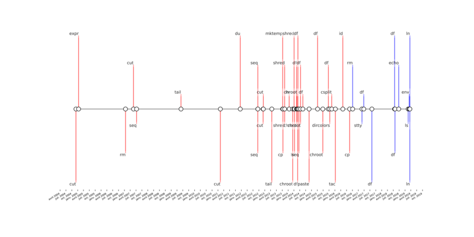
* The fiugure shows the commits in the time line. The commits marked by the red are the history commits as the training dataset. The remaining blue commits are the future commits as the test dataset. We can see that some programs exists in the history and the future commits but some programs only exist in the training dataset or the test dataset, e.g., `ls` only exists in the test dataset but `cut` only exists in the training dataset.

## Selection Model Performance
### Motivation of Selection Mutants using Machine Learing Model
The most difficulty of Mutation Testing is that it is resource-intensive. The most common way is using random selection to take some mutnats and use them to test. Although random sampling is good enough, it still cannot target the specific mutants well. Given a specific task, it is possible that only `1%` or less of mutants are meaningful. Random selection hits these kinds of mutants by low chance. Therefore, it is urgering to come up with a new technique to complement the random algorithm in some testing scenarios.
Our experiments shows that random algorithm is not a bad method but the low bound of its performance is not guarantted with large variance. However, MuDelta is stable with smaller variance and can guaranttee the lower bound of RMS.

### Feature Importance
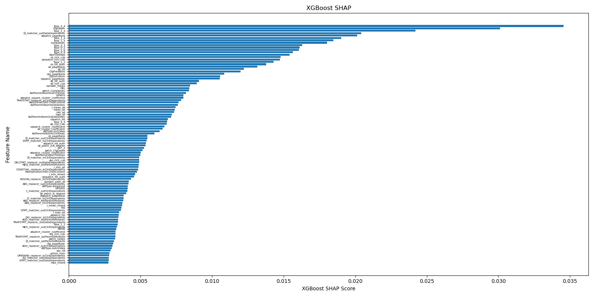
* The figure shows the feature importance. The importance score are counted by the number of the feature are used for splitting by the estimators. It shows that Mutant Type and  Mean Path Length between the mutant node and the modification node are the most two import features. The third important feature is Pange Rank score. It can be interpreted well. Mutant type decides what is the mutation change. Mean Path Length takes care of the distance between the mutant and modification. Page Rank tells how the mutant node are linked in the program dependence graph. Decesion tree is more explainable than the black box Deep Learning.

### Precision-Recall Curve and ROC-Curve for each commit of the test dataset
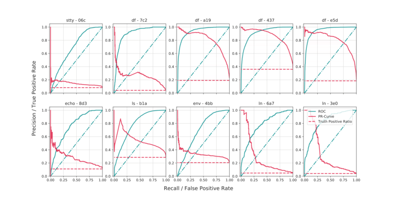
* The figure shows that Precsion-Recall Curve and ROC-Curve of each commit from the test dataset. It shows that the model performs well for all the commits in the test dataset, which is better than the random classifier.

### Precsion-Recall Changing Trending for Ordered Mutants by the output probabilities

* The figures illustrates how the precsion and recall changes with the ranked mutants. At first, we sort all the mutants by the probabilities of the model descendingly. Then we computes the precsion and recall curves with the sorted order.

### Precision from Top - 1 to Top - 100 mutants
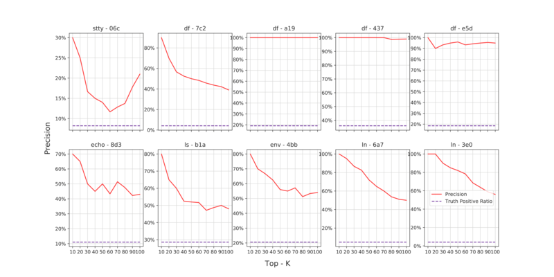
* The figure shows that the precsion of top 10 to 100. The dashed line is the truth positive ratio.

## Subsuming Relevant Mutation Score (rMS*) based on Selected Mutants

### rMS* of Top 10 to 100 Mutants

* The figure shows the subsuming Relevant Mutant Score among Top10, Top30, Top50 and Top100. It is concluded that it is not engouh to only consider the mutants from the modification. MuDelta works better than Random method.

### APFD (rMS*) of Subsuming Top 30,100 Mutants
To demonstrate the difference between MuDelta and Random methods, we also compute the area (APFD) of rMS* of Top30, and Top100. The underneath figures demonstrates the results. Specifically, we also plots APFD for each commit in the test dataset.

<!---

!--->
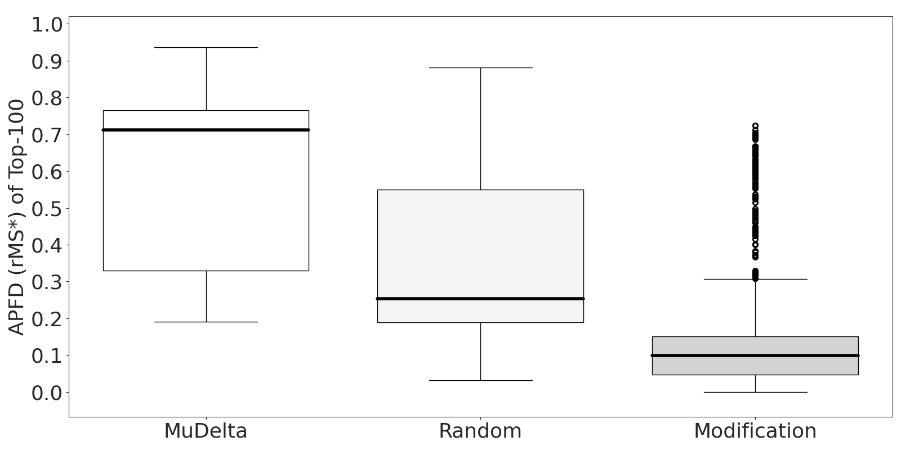
* APFD of rMS* for Top 30 and Top 100.

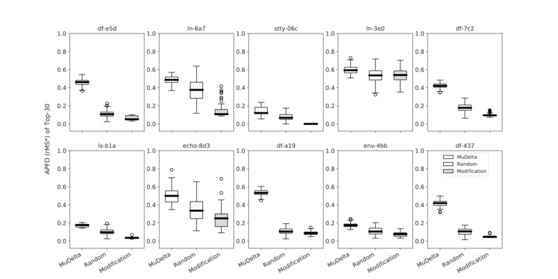
<!---

!--->
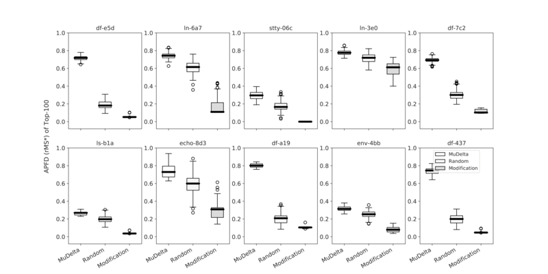
* APFD of rMS* of each test commit for Top 30 and Top 100.

## Relevant Mutation Score based on Selected Mutants

### RMS of Top 5 to 100 Mutants

* The figure shows the Relevant Mutant Score (RMS) among Top5, Top10, Top30, Top50, Top80 and Top100. It is concluded that it is not engouh to only consider the mutants from the modification. MuDelta works better than Random method.

### APFD of RMS, Top 30,100 Mutants
To demonstrate the difference between MuDelta and Random methods, we also compute the area (APFD) of RMS of Top30 and Top100. The underneath figures demonstrates the results. Specifically, we also plots APFD for each commit in the test dataset.

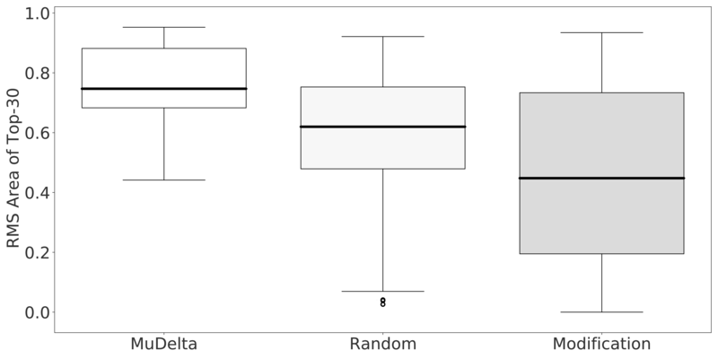
<!---
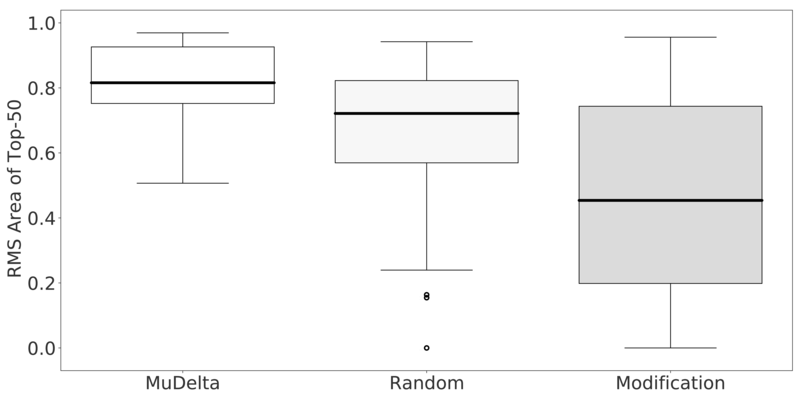
!--->
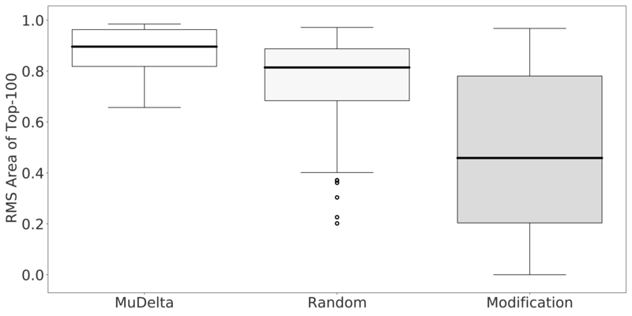
* APFD of RMS for Top 30 and Top 100.

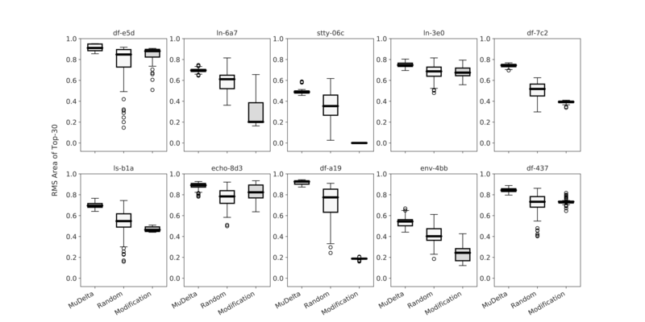
<!---
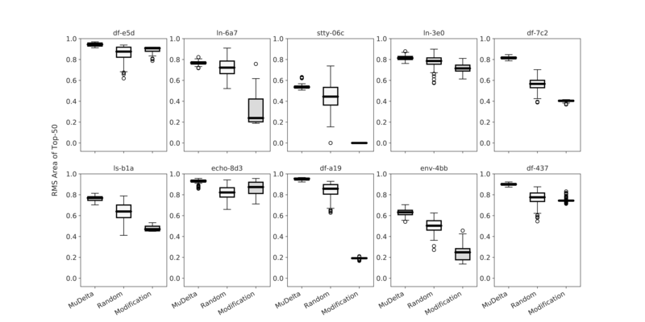
!--->

* APFD of RMS of each test commit for Top 30 and Top 100.

### VD.A Test

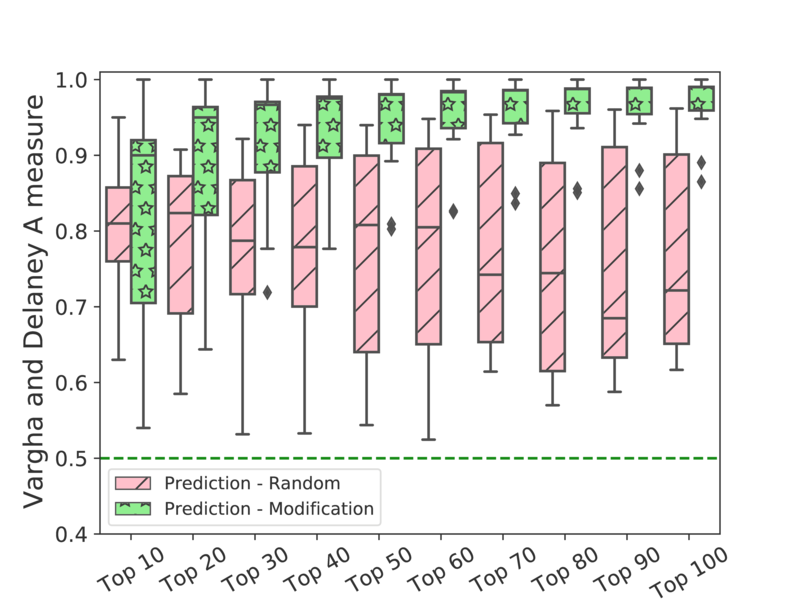

## NLP model Trials and Discussion, following the trending in Software Engineering
### Feature Design Discussion
When we design the features, there are three things that we should consider, mutant feature, modification feature and the link feature between the mutant and modification. At first, we extract the features from AST tree for mutant feature. AST can represent the syntax information. And then we use the static analysis to capture the semantic and structure information from the program dependency graphs. To capture more characteristics of the code changes, we also use GumTree to extract the editing features between two pre-AST and post-AST, and summarize the commit file manually.
We also tried using Attention Autoencoder (Deep Learning) to extract the features. Unfortunately, it does not work in the mutant context. One possible reason is that we use the first-order mutant operator so that the small mutant (difference) is very hard to be encoded. Autoencoder mainly captures the main characteristics with tolerance of losing some information which is contrary to the expectation to capture the small difference while keeping the main information. It makes harder to train this kind of unsupervised autoencoder even though using attention mechanism.

### Model Choosing Discussion
Besides the decision tree, we also tried some fancy models following the trending in Software Engineering. [Ben-Nun et.al](https://arxiv.org/abs/1806.07336) embeds LLVM Instruction to the vector space, and succeed using the embedding feature to do some simple tasks, e.g., predicting the function name.The method of [Ben-Nun et.al](https://arxiv.org/abs/1806.07336) needs mask the variable name, structure name and so on details in the program, which is the comman preprocessing of NLP in Software Engineering. We tried the similar way but keep the details about mutants and their context, and build a program dependence graph to predict and rank the relevant mutants. Considering there are many training tricks to make a deep learning model work, we tried using [Fairseq](https://github.com/pytorch/fairseq) maintained by Facebook instead of implementing and training the model by self. Fairseq provides many optimization and training tricks insides. The result is still not good and is equal to the random classifier as shown in Figure below.

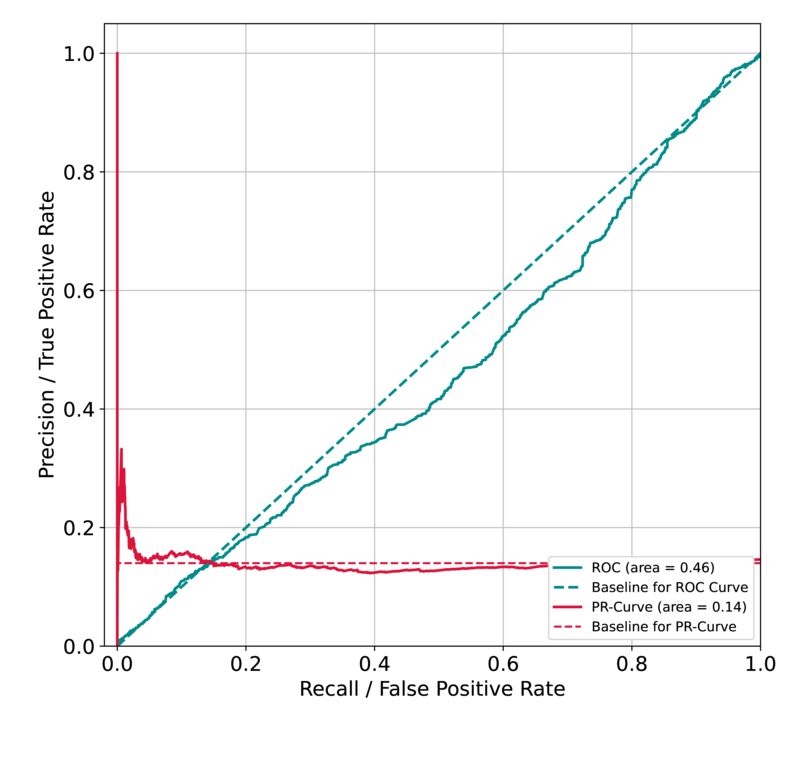
* For this figure, we do not use all the commits (but still a lot) to validate if the model work.

One possible reason is that give a text input`S`, it is represented by `v` in vector space. We randomly change an alphabet in `S`, denoted the new text as `S'`. And we want to learn when `S` and`S'` are close in the vector space and when they are far away. `S` and`S'`have the very similary context. The common preprocess (masking Variable, Method name and so on) of NLP in Software Engineering cannot be used because it will make the similar mutants the same. It gets much complicated in the code mutation context than negation in Natural Language Process. Mutation can happen in any place of the code, which is full of **Diversity**, **Randomness** and **Dynamics**. It is hard to train the natural language model to infer these kinds of mutated patterns.

## Using program slicing?

The problem of determining the set of mutants that are most relevant to a particular code change might resemble a dependence analysis problem. One natural solution (with which we first experimented) involved forming a program slice on the set of changed statements. Any mutant that lies in the slice should be considered relevant. Unfortunately, this approach does not scale for several reasons. Firstly, as have been previously observed [David W. et.al](https://ieeexplore.ieee.org/document/1510114) and [their emprical study](https://citeseerx.ist.psu.edu/viewdoc/download?doi=10.1.1.66.2601&rep=rep1&type=pdf), even a single static slice of a program tends to occupy between one and two thirds of the program from which it is constructed. Therefore, the union of a set of such slices, will tend to be very large, and thereby fail to exclude many mutants. Secondly, the dependence analysis would need to be incremental, which raises further challenges. Although there have been incremental dependence analyses in the literature, many well-developed slicing systems are not incremental. In general, the problem of incremental program analysis at scale [remains challenging](https://ieeexplore.ieee.org/document/8530713). Thirdly, although a dependence analysis such as slicing can identify a set of relevant statements, it is hard to use dependence analysis to provide the priority ordering we need, where priority is based on degree of relevance. Potentially, unions of dynamic slices or some form of [observation-based slicing](https://dl.acm.org/doi/proceedings/10.1145/2635868) could achieve this, but having initially started trying such approaches we found the computational cost was prohibitive by comparison with machine learning-based approaches. We therefore abandoned dependence analysis at the (failed) proof of concept stage of development  to concentrate on the machine leaning based approach.

## Future View
We tried the widely used NLP methods in Software Engineering, e.g., Atuoencoder, Attention mechanism and Reinforcement Learning. From our experience, it can be very interesting to go ahead and study the applicable scenarios of Natural Language Process in Software Engineering.
